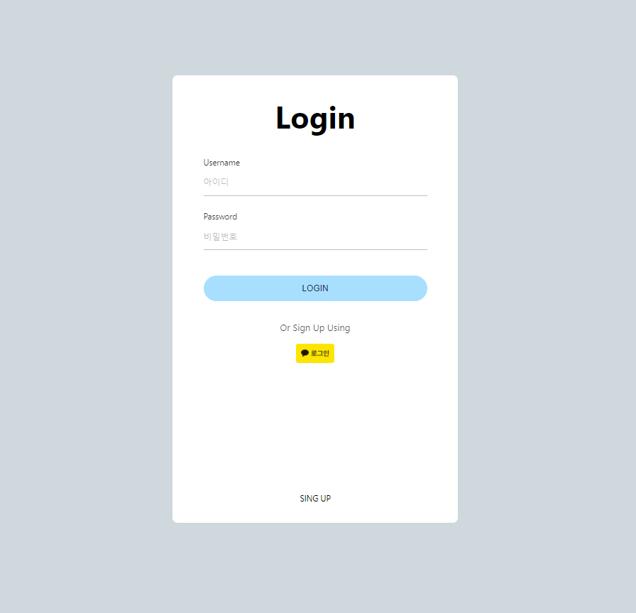

# React-kakaoTalk

## 기능

- 회원가입
- 로그인
- 카카오 로그인
- 로그아웃

## ETC

- styled component
- react-router
- passport
- sequelize
- mysql

 

## 로그인 화면 ( / )

 

 

## 회원가입 화면 (/join)

 

 

## 메인 화면 (/main)

 

## 기능 화면 (/add)

